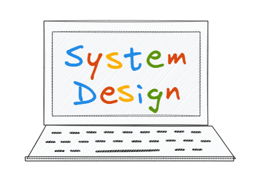

# Master System Design Like a Pro 🚀

Understand key system design concepts with clarity and real-world examples.  

Whether you're a software engineer, architect, or just curious about building scalable and high-performing systems, you'll find valuable lessons here.  

Dive in, explore, and let's build a strong foundation in system design together!

## 🧩 System Design Trade-offs That Matter 
- [Performance vs Scalability](https://thesystemthinker.substack.com/p/performance-vs-scalability)
